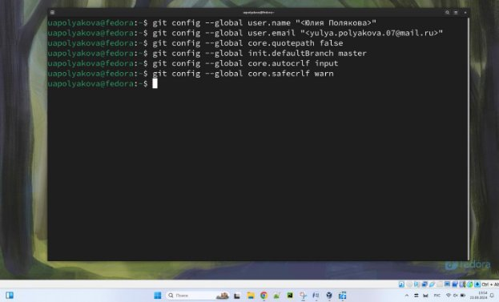

---
## Front matter
title: "ОТЧЕТ по лабораторной работе №2"
author: "Полякова Юлия Александровна"

## Generic otions
lang: ru-RU
toc-title: "Содержание"

## Bibliography
bibliography: bib/cite.bib
csl: pandoc/csl/gost-r-7-0-5-2008-numeric.csl

## Pdf output format
toc: true # Table of contents
toc-depth: 2
lof: true # List of figures
lot: true # List of tables
fontsize: 12pt
linestretch: 1.5
papersize: a4
documentclass: scrreprt
## I18n polyglossia
polyglossia-lang:
  name: russian
  options:
	- spelling=modern
	- babelshorthands=true
polyglossia-otherlangs:
  name: english
## I18n babel
babel-lang: russian
babel-otherlangs: english
## Fonts
mainfont: IBM Plex Serif
romanfont: IBM Plex Serif
sansfont: IBM Plex Sans
monofont: IBM Plex Mono
mathfont: STIX Two Math
mainfontoptions: Ligatures=Common,Ligatures=TeX,Scale=0.94
romanfontoptions: Ligatures=Common,Ligatures=TeX,Scale=0.94
sansfontoptions: Ligatures=Common,Ligatures=TeX,Scale=MatchLowercase,Scale=0.94
monofontoptions: Scale=MatchLowercase,Scale=0.94,FakeStretch=0.9
mathfontoptions:
## Biblatex
biblatex: true
biblio-style: "gost-numeric"
biblatexoptions:
  - parentracker=true
  - backend=biber
  - hyperref=auto
  - language=auto
  - autolang=other*
  - citestyle=gost-numeric
## Pandoc-crossref LaTeX customization
figureTitle: "Рис."
tableTitle: "Таблица"
listingTitle: "Листинг"
lofTitle: "Список иллюстраций"
lotTitle: "Список таблиц"
lolTitle: "Листинги"
## Misc options
indent: true
header-includes:
  - \usepackage{indentfirst}
  - \usepackage{float} # keep figures where there are in the text
  - \floatplacement{figure}{H} # keep figures where there are in the text
---

# Цель работы

Изучить  идеологию  и  применение  средств  контроля  версий.  Приобрести практические навыки по работе с системой git. 

# Результаты выполнения лабораторной работы

1. Настройка GitHub 

Так  как  аккаунт  в  GitHub  имелся,  то  дополнительная  настройка  не потребовалась (Рис. 1). 

{#fig:001 width=70%}

2. Базовая настройка git 

Сначала  сделаем  предварительную  конфигурацию  git.  Настроим  utf-8  в выводе сообщений git. Зададим имя начальной ветки. Параметр autocrlf и safecrlf. (Рис. 2) 

{#fig:002 width=70%}

3. Создание SSH ключа 

Генерируем пару ключей (приватный и открытый). Добавляем ключ на сайт. (Рис. 3 - 4) 

{#fig:003 width=70%}

{#fig:004 width=70%}

4. Создание рабочего пространства и репозитория курса на основе шаблона Создаем каталог для предмета «Архитектура компьютера» (Рис. 5).

{#fig:005 width=70%}

5. Создание репозитория курса на основе шаблона 

Создаем репозиторий на основе шаблона через GitHub, через терминал переходим в каталог курса и клонируем созданный репозиторий. (Рис. 6 - 7)

{#fig:006 width=70%}

{#fig:007 width=70%}

6. Настройка каталога курса 

Переходим в каталог курса и удаляем лишние файлы (Скриншот не сохранился, но в коммите это видно [https://github.com/JuliaMaffin123/study_2024- 2025_arh-pc/commit/63894708010814aada25799cf197b96e76ba215c)](https://github.com/JuliaMaffin123/study_2024-2025_arh-pc/commit/63894708010814aada25799cf197b96e76ba215c).  Создаем необходимые каталоги (Рис. 8).

{#fig:008 width=70%}

Отправляем файлы на сервер (Рис. 9). 

{#fig:009 width=70%}
{#fig:010 width=70%}

Проверяем иерархию на GitHub (Рис. 10) 

{#fig:011 width=70%}

# Результаты выполнения заданий для самостоятельной работы

1. Отчет будет находиться в соответствующем каталоге рабочего пространства на GitHub. 

[https://github.com/JuliaMaffin123/study_2024-2025_arh-pc/tree/master/labs/lab02/report](https://github.com/JuliaMaffin123/study_2024-2025_arh-pc/tree/master/labs/lab02/report)).

2. Отчет по Лабораторной работе №1 был скопирован в соответствующий каталог (Рис. 11). 

{#fig:012 width=70%}

3. Файлы загружены на GitHub через сайт.

# Вывод

Изучена идеология и применение средств контроля версий. Приобретены практические навыки по работе с системой git. 
