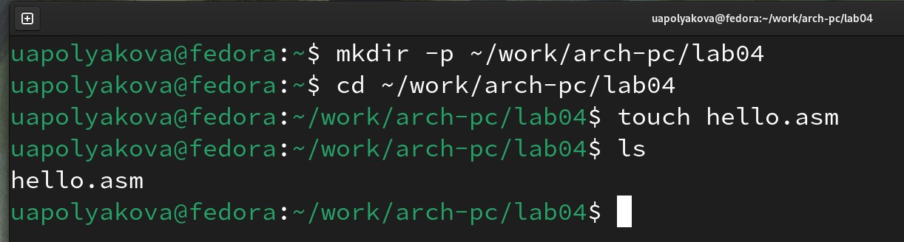
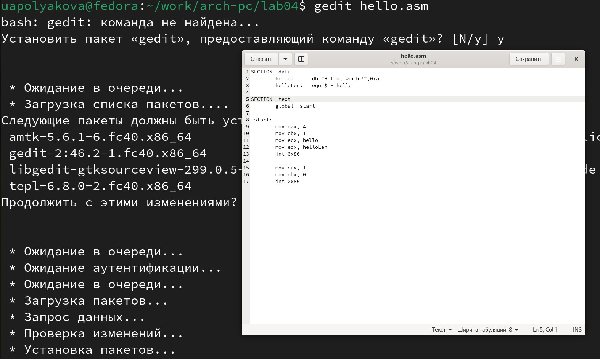
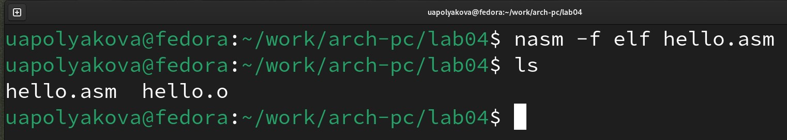
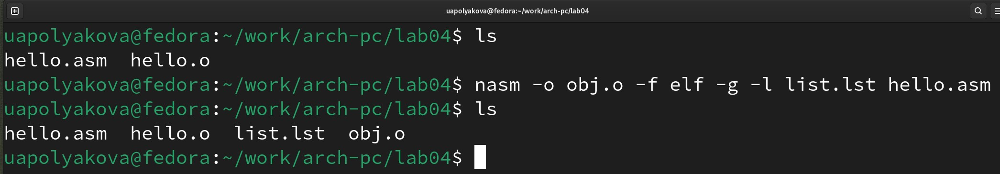
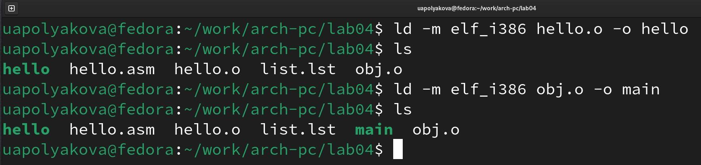
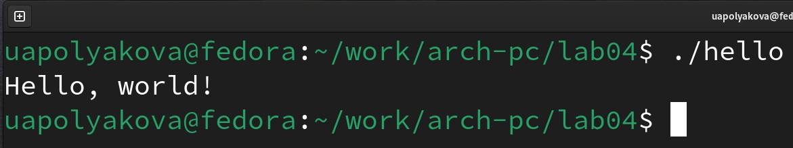
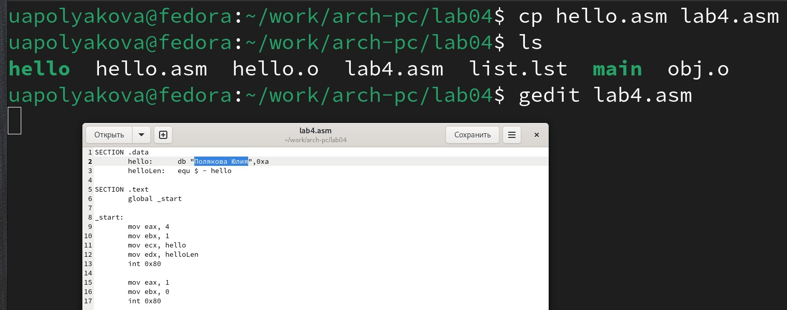
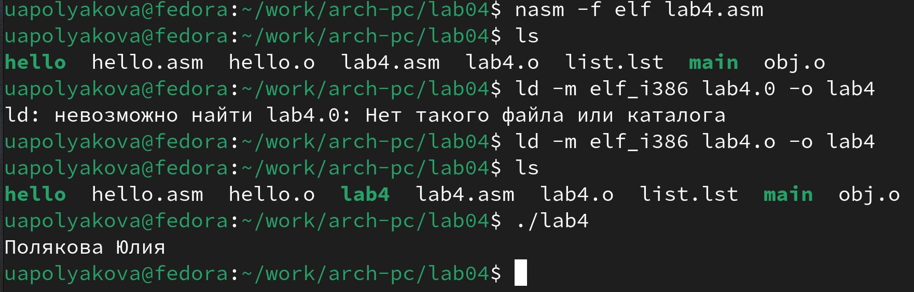
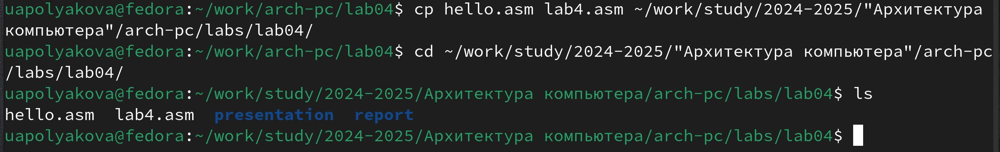
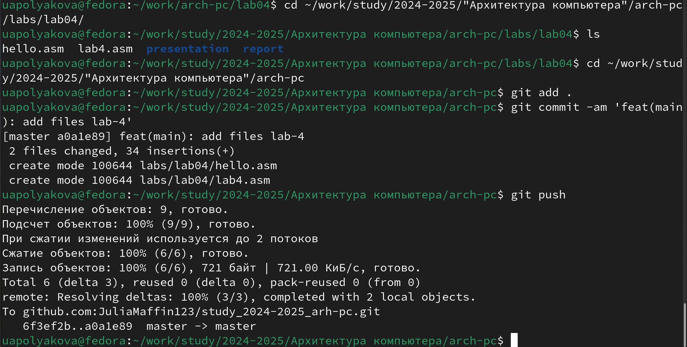

---
## Front matter
title: "ОТЧЕТ по лабораторной работе №4"
author: "Полякова Юлия Александровна"

## Generic otions
lang: ru-RU
toc-title: "Содержание"

## Bibliography
bibliography: bib/cite.bib
csl: pandoc/csl/gost-r-7-0-5-2008-numeric.csl

## Pdf output format
toc: true # Table of contents
toc-depth: 2
lof: true # List of figures
lot: true # List of tables
fontsize: 12pt
linestretch: 1.5
papersize: a4
documentclass: scrreprt
## I18n polyglossia
polyglossia-lang:
  name: russian
  options:
	- spelling=modern
	- babelshorthands=true
polyglossia-otherlangs:
  name: english
## I18n babel
babel-lang: russian
babel-otherlangs: english
## Fonts
mainfont: IBM Plex Serif
romanfont: IBM Plex Serif
sansfont: IBM Plex Sans
monofont: IBM Plex Mono
mathfont: STIX Two Math
mainfontoptions: Ligatures=Common,Ligatures=TeX,Scale=0.94
romanfontoptions: Ligatures=Common,Ligatures=TeX,Scale=0.94
sansfontoptions: Ligatures=Common,Ligatures=TeX,Scale=MatchLowercase,Scale=0.94
monofontoptions: Scale=MatchLowercase,Scale=0.94,FakeStretch=0.9
mathfontoptions:
## Biblatex
biblatex: true
biblio-style: "gost-numeric"
biblatexoptions:
  - parentracker=true
  - backend=biber
  - hyperref=auto
  - language=auto
  - autolang=other*
  - citestyle=gost-numeric
## Pandoc-crossref LaTeX customization
figureTitle: "Рис."
tableTitle: "Таблица"
listingTitle: "Листинг"
lofTitle: "Список иллюстраций"
lotTitle: "Список таблиц"
lolTitle: "Листинги"
## Misc options
indent: true
header-includes:
  - \usepackage{indentfirst}
  - \usepackage{float} # keep figures where there are in the text
  - \floatplacement{figure}{H} # keep figures where there are in the text
---

# Цель работы

Освоение процедуры компиляции и сборки программ, написанных на ассемблере NASM.

# Результаты выполнения лабораторной работы

1. Создаем каталог для работы с программами на языке ассемблера NASM, переходим в него, создаем файл hello.asm (рис. 1).

{#fig:001 width=70%}

2. Открываем файл в текстовом редакторе и вводим в него текст программы (рис. 2).

{#fig:002 width=70%}

3. Компилируем введенную выше программу, проверяем наличие файлов (рис. 3).

{#fig:003 width=70%}

Объектный файл называется hello.o

4. Выполняем компиляцию расширенной командой, проверяем наличие файлов (рис. 4).

{#fig:004 width=70%}

5. Передаем программу компоновщику, проверяем создание исполняемого файла hello, то же делаем для obj (рис. 5).

{#fig:005 width=70%}

Исполняемый файл называется main, он собран из объектного файла obj.o

6. Запускаем программу (рис. 6).

{#fig:006 width=70%}

# Результаты выполнения заданий для самостоятельной работы

1. Создаем копию файла, меняем текст программы, чтобы выводились имя и фамилия (рис. 7).

{#fig:007 width=70%}

2. Транслируем текст программы в объектный файл, выполняем его компоновку, запускаем исполняемый файл (рис. 8).

{#fig:008 width=70%}

3. Копируем файлы в локальный репозиторий (рис. 9).

{#fig:009 width=70%}

4. Загружаем на Github (рис. 10).

{#fig:010 width=70%}

# Выводы

Были освоениы процедуры компиляции и сборки программ, написанных на ассемблере NASM.

