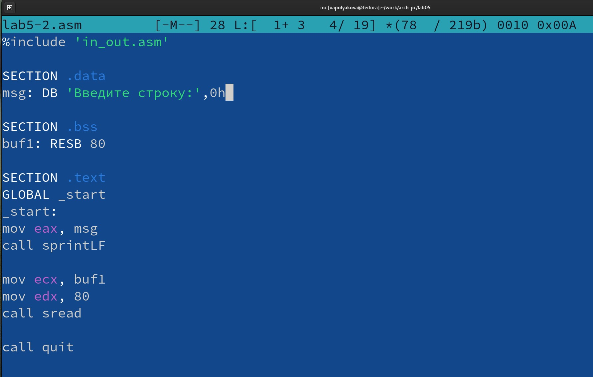

---
## Front matter
title: "ОТЧЕТ по лабораторной работе №5"
author: "Полякова Юлия Александровна"

## Generic otions
lang: ru-RU
toc-title: "Содержание"

## Bibliography
bibliography: bib/cite.bib
csl: pandoc/csl/gost-r-7-0-5-2008-numeric.csl

## Pdf output format
toc: true # Table of contents
toc-depth: 2
lof: true # List of figures
lot: true # List of tables
fontsize: 12pt
linestretch: 1.5
papersize: a4
documentclass: scrreprt
## I18n polyglossia
polyglossia-lang:
  name: russian
  options:
	- spelling=modern
	- babelshorthands=true
polyglossia-otherlangs:
  name: english
## I18n babel
babel-lang: russian
babel-otherlangs: english
## Fonts
mainfont: IBM Plex Serif
romanfont: IBM Plex Serif
sansfont: IBM Plex Sans
monofont: IBM Plex Mono
mathfont: STIX Two Math
mainfontoptions: Ligatures=Common,Ligatures=TeX,Scale=0.94
romanfontoptions: Ligatures=Common,Ligatures=TeX,Scale=0.94
sansfontoptions: Ligatures=Common,Ligatures=TeX,Scale=MatchLowercase,Scale=0.94
monofontoptions: Scale=MatchLowercase,Scale=0.94,FakeStretch=0.9
mathfontoptions:
## Biblatex
biblatex: true
biblio-style: "gost-numeric"
biblatexoptions:
  - parentracker=true
  - backend=biber
  - hyperref=auto
  - language=auto
  - autolang=other*
  - citestyle=gost-numeric
## Pandoc-crossref LaTeX customization
figureTitle: "Рис."
tableTitle: "Таблица"
listingTitle: "Листинг"
lofTitle: "Список иллюстраций"
lotTitle: "Список таблиц"
lolTitle: "Листинги"
## Misc options
indent: true
header-includes:
  - \usepackage{indentfirst}
  - \usepackage{float} # keep figures where there are in the text
  - \floatplacement{figure}{H} # keep figures where there are in the text
---

# Цель работы

Приобретение практических навыков работы в Midnight Commander. Освоение инструкций языка ассемблера mov и int.

# Результаты выполнения лабораторной работы

1. Создаем каталог lab05 с помощью mc, переходим в него (рис. 1).

{#fig:001 width=70%}

2. С помощью строки ввода и touch создаем файл (рис. 2).

{#fig:002 width=70%}

3. Проверяем его наличие (рис. 3).

{#fig:003 width=70%}

4. Открываем файл в встроенном текстовом редакторе и вводим в него текст программы (рис. 4).

{#fig:004 width=70%}

5. Открываем файл в режиме просмотра и проверяем наличие программы (рис. 5).

{#fig:005 width=70%}

6. Транслируем, компонуем и запускаем программу (рис. 6).

{#fig:006 width=70%}

7. Копируем файл in_out.asm в папку с программой (рис. 7).

{#fig:007 width=70%}

8. Так как клавиша F6 перемещает, а не копирует содержимое файла, lab5-1.asm стал lab5-2.asm (рис. 8).

{#fig:008 width=70%}

9. Корректируем текст программы (рис. 9).

{#fig:009 width=70%}

10. Создаем исполняемый файл и проверяем его работу (рис. 10).

{#fig:010 width=70%}

11. Меняем sprintLF на sprint. Создаем исполняемый файл и проверяем его работу (рис. 11).

{#fig:011 width=70%}

Во втором случае sprint не добавляет символ переноса строки.

# Результаты выполнения заданий для самостоятельной работы

1. Создаем копию lab5-1.asm, изменяем код так, чтобы он дополнительно выводил введенную строку на экран (рис. 12).

{#fig:012 width=70%}

2. Создаем исполняемый файл и проверяем его работу (рис. 13).

{#fig:013 width=70%}

3. Создаем копию lab5-2.asm, изменяем код так, чтобы он дополнительно выводил введенную строку на экран (рис. 14).

{#fig:014 width=70%}

4. Создаем исполняемый файл и проверяем его работу (рис. 15).

{#fig:015 width=70%}

# Выводы

Были приобретены практические навыки работы в Midnight Commander. Были освоены инструкции языка ассемблера mov и int.
