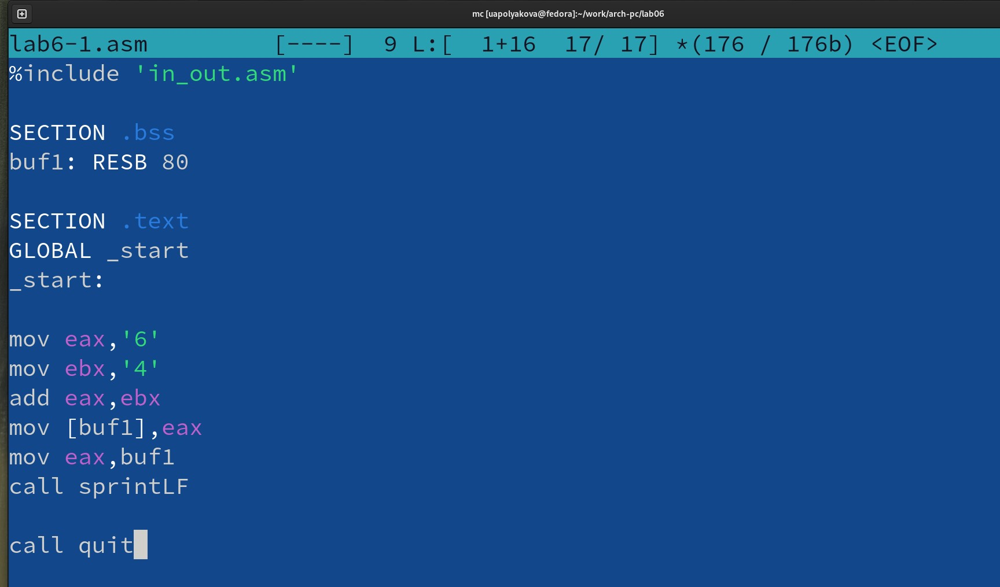

---
## Front matter
title: "ОТЧЕТ по лабораторной работе №6"
author: "Полякова Юлия Александровна"

## Generic otions
lang: ru-RU
toc-title: "Содержание"

## Bibliography
bibliography: bib/cite.bib
csl: pandoc/csl/gost-r-7-0-5-2008-numeric.csl

## Pdf output format
toc: true # Table of contents
toc-depth: 2
lof: true # List of figures
lot: true # List of tables
fontsize: 12pt
linestretch: 1.5
papersize: a4
documentclass: scrreprt
## I18n polyglossia
polyglossia-lang:
  name: russian
  options:
	- spelling=modern
	- babelshorthands=true
polyglossia-otherlangs:
  name: english
## I18n babel
babel-lang: russian
babel-otherlangs: english
## Fonts
mainfont: IBM Plex Serif
romanfont: IBM Plex Serif
sansfont: IBM Plex Sans
monofont: IBM Plex Mono
mathfont: STIX Two Math
mainfontoptions: Ligatures=Common,Ligatures=TeX,Scale=0.94
romanfontoptions: Ligatures=Common,Ligatures=TeX,Scale=0.94
sansfontoptions: Ligatures=Common,Ligatures=TeX,Scale=MatchLowercase,Scale=0.94
monofontoptions: Scale=MatchLowercase,Scale=0.94,FakeStretch=0.9
mathfontoptions:
## Biblatex
biblatex: true
biblio-style: "gost-numeric"
biblatexoptions:
  - parentracker=true
  - backend=biber
  - hyperref=auto
  - language=auto
  - autolang=other*
  - citestyle=gost-numeric
## Pandoc-crossref LaTeX customization
figureTitle: "Рис."
tableTitle: "Таблица"
listingTitle: "Листинг"
lofTitle: "Список иллюстраций"
lotTitle: "Список таблиц"
lolTitle: "Листинги"
## Misc options
indent: true
header-includes:
  - \usepackage{indentfirst}
  - \usepackage{float} # keep figures where there are in the text
  - \floatplacement{figure}{H} # keep figures where there are in the text
---

# Цель работы

Освоение арифметических инструкций языка ассемблера NASM.

# Результаты выполнения лабораторной работы

1. Создаем каталог для программ лабораторной №6, переходим в него и создаем файл lab6-1.asm (Рис. 1).

{#fig:001 width=70%}

2. Записываем в файл программу из листинга 6.1. (Рис. 2).

{#fig:002 width=70%}

3. Создаем исполняемый файл и запускаем его (Рис. 3).

{#fig:003 width=70%}

4. Изменяем текст программы, вместо символов записываем в регистры числа (Рис. 4)

{#fig:004 width=70%}

5. Создаем исполняемый файл и запускаем его (Рис. 5).

{#fig:005 width=70%}

По таблице ASCII это символ переноса строки \\n (Рис. 6).

{#fig:006 width=70%}

Он отображается при выводе на экран, так как видно, что после запуска программы образуются две пустые строки.

6. Создаем lab6-2.asm по листингу 6.2. (Рис. 7).

{#fig:007 width=70%}

7. Создаем исполняемый файл и запускаем его (Рис. 8).

{#fig:008 width=70%}

8. Изменяем символы на числа. 

{#fig:009 width=70%}

9. Создаем исполняемый файл и запускаем его (Рис. 10).

{#fig:010 width=70%}

В результате выведется число 10, а не символ, кодом которого является это число.

10. Заменяем iprintLF на iprint, создаем исполняемый файл и запускаем его (Рис. 11).

{#fig:011 width=70%}

Функция iprint выводит без переноса строки.

11. Создаем lab6-3.asm по листингу 6.3. (Рис. 12).

{#fig:012 width=70%}

12. Создаем исполняемый файл и запускаем его (Рис. 13).

{#fig:013 width=70%}

13. Изменяем текст для вычисления (4*6+2)/5 (Рис. 14).

{#fig:014 width=70%}

14. Создаем исполняемый файл и запускаем его (Рис. 15).

{#fig:015 width=70%}

15. Создаем variant.asm по листингу 6.4. (Рис. 16).

{#fig:016 width=70%}

16. Создаем исполняемый файл и запускаем его (Рис. 17).

{#fig:017 width=70%}

Проверим. Остаток от деления последних цифр 02 на 20 это 2. 2 + 1 это 3. Следовательно вариант 3.

**Ответы на вопросы:**

1. Строки

```
mov eax,rem
call sprint
```

2. Для записи адреса переменной в 'EAX', записи длины вводимого сообщения в 'EBX' и вызова подпрограммы ввода сообщения.

3. Для преобразования символов ASCII кода в числа.

4. Строки

```
xor edx,edx
mov ebx,20
div ebx
inc edx
```

5. В регистр edx.

6. Чтобы прибавить единицу (сделать инкремент) к остатку от деления на 20.

7. Строки

```
mov eax,edx
call iprintLF
```

# Результаты выполнения заданий для самостоятельной работы

1. Вариант 3. Программа для вычисления (2 + х)^2 в файле samrab.asm (рис. 18).

{#fig:018 width=70%}

2. Создаем исполняемый файл и проверяем его работу (рис. 19).

{#fig:019 width=70%}

# Вывод

Были освоены арифметические инструкции языка ассемблера NASM.
