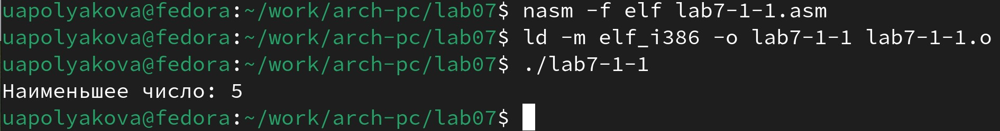

---
## Front matter
title: "ОТЧЕТ по лабораторной работе №7"
author: "Полякова Юлия Александровна"

## Generic otions
lang: ru-RU
toc-title: "Содержание"

## Bibliography
bibliography: bib/cite.bib
csl: pandoc/csl/gost-r-7-0-5-2008-numeric.csl

## Pdf output format
toc: true # Table of contents
toc-depth: 2
lof: true # List of figures
lot: true # List of tables
fontsize: 12pt
linestretch: 1.5
papersize: a4
documentclass: scrreprt
## I18n polyglossia
polyglossia-lang:
  name: russian
  options:
	- spelling=modern
	- babelshorthands=true
polyglossia-otherlangs:
  name: english
## I18n babel
babel-lang: russian
babel-otherlangs: english
## Fonts
mainfont: IBM Plex Serif
romanfont: IBM Plex Serif
sansfont: IBM Plex Sans
monofont: IBM Plex Mono
mathfont: STIX Two Math
mainfontoptions: Ligatures=Common,Ligatures=TeX,Scale=0.94
romanfontoptions: Ligatures=Common,Ligatures=TeX,Scale=0.94
sansfontoptions: Ligatures=Common,Ligatures=TeX,Scale=MatchLowercase,Scale=0.94
monofontoptions: Scale=MatchLowercase,Scale=0.94,FakeStretch=0.9
mathfontoptions:
## Biblatex
biblatex: true
biblio-style: "gost-numeric"
biblatexoptions:
  - parentracker=true
  - backend=biber
  - hyperref=auto
  - language=auto
  - autolang=other*
  - citestyle=gost-numeric
## Pandoc-crossref LaTeX customization
figureTitle: "Рис."
tableTitle: "Таблица"
listingTitle: "Листинг"
lofTitle: "Список иллюстраций"
lotTitle: "Список таблиц"
lolTitle: "Листинги"
## Misc options
indent: true
header-includes:
  - \usepackage{indentfirst}
  - \usepackage{float} # keep figures where there are in the text
  - \floatplacement{figure}{H} # keep figures where there are in the text
---

# Цель работы

Изучение команд условного и безусловного переходов. Приобретение навыков написания программ с использованием переходов. Знакомство с назначением и структурой файла листинга.

# Результаты выполнения лабораторной работы

1. Создаем каталог для программ лабораторной №7, переходим в него и создаем файл lab7-1.asm (Рис. 1).

{#fig:001 width=70%}

2. Записываем в файл программу из листинга 7.1. (Рис. 2).

{#fig:002 width=70%}

3. Создаем исполняемый файл и запускаем его (Рис. 3).

{#fig:003 width=70%}

4. Изменяем текст программы в соответствии с листингом 7.2 (Рис. 4)

{#fig:004 width=70%}

5. Создаем исполняемый файл и запускаем его (Рис. 5).

{#fig:005 width=70%}

6. Изменяем программу для требуемого вывода (Рис. 6).

{#fig:006 width=70%}

7. Создаем исполняемый файл и запускаем его (Рис. 7).

{#fig:007 width=70%}

8. Создаем lab7-2.asm по листингу 7.3. (Рис. 8).

{#fig:008 width=70%}

9. Создаем исполняемый файл и запускаем его для разных значений (Рис. 9).

{#fig:009 width=70%}

10. Создаем файл листинга для lab7-2.asm и открываем его любым редактором. Был выбран gedit (Рис. 10).

{#fig:010 width=70%}

11. Для объяснения выбраны последние строки файла in_out.asm (Рис. 11).

{#fig:011 width=70%}

Каждая строка состоит из дополнительной информации и строк кода из основной программы.
В данном случае дополнительная информация состоит из трех столбцов.
Первый - это номер строки в основном коде (167, 168, 169).
Второй - адрес (то есть смещение машинного кода от начала текущего сегмента).
Третий - это инструкция на машинном коде, то есть CD80 - это инструкция прерывания ядра.

12. Удаляем один операнд из lab7-2.asm (Рис. 12).

{#fig:012 width=70%}

13. Выполняем трансляцию с созданием листинга. Создался только листинг (исполняемый файл остался с прошлых запусков) (Рис. 13).

{#fig:013 width=70%}

В листинге добавляется строчка с ошибкой (Рис. 14).

{#fig:014 width=70%}

# Результаты выполнения заданий для самостоятельной работы

1. Создаем программу для нахождения наименьшего из трех чисел. Вариант 3, значит значения (94, 5, 58). Файл lab7-1-1.asm (Рис. 15).

{#fig:015 width=70%}

2. Создаем исполняемый файл и запускаем его (Рис. 16).

{#fig:016 width=70%}

3. Создаем программу, которая вычисляет значение функции в зависимости от введенных х и а. Вариант 3, файл lab7-1-2.asm (Рис. 17).

{#fig:017 width=70%}

4. Создаем исполняемый файл и запускаем его (рис. 18).

{#fig:018 width=70%}

# Вывод

Были изучены команды условного и безусловного переходов и приобретены навыки написания программ с использованием переходов. Были изучены назначение и структура файла листинга.
