---
## Front matter
title: "ОТЧЕТ по лабораторной работе №8"
author: "Полякова Юлия Александровна"

## Generic otions
lang: ru-RU
toc-title: "Содержание"

## Bibliography
bibliography: bib/cite.bib
csl: pandoc/csl/gost-r-7-0-5-2008-numeric.csl

## Pdf output format
toc: true # Table of contents
toc-depth: 2
lof: true # List of figures
lot: true # List of tables
fontsize: 12pt
linestretch: 1.5
papersize: a4
documentclass: scrreprt
## I18n polyglossia
polyglossia-lang:
  name: russian
  options:
	- spelling=modern
	- babelshorthands=true
polyglossia-otherlangs:
  name: english
## I18n babel
babel-lang: russian
babel-otherlangs: english
## Fonts
mainfont: IBM Plex Serif
romanfont: IBM Plex Serif
sansfont: IBM Plex Sans
monofont: IBM Plex Mono
mathfont: STIX Two Math
mainfontoptions: Ligatures=Common,Ligatures=TeX,Scale=0.94
romanfontoptions: Ligatures=Common,Ligatures=TeX,Scale=0.94
sansfontoptions: Ligatures=Common,Ligatures=TeX,Scale=MatchLowercase,Scale=0.94
monofontoptions: Scale=MatchLowercase,Scale=0.94,FakeStretch=0.9
mathfontoptions:
## Biblatex
biblatex: true
biblio-style: "gost-numeric"
biblatexoptions:
  - parentracker=true
  - backend=biber
  - hyperref=auto
  - language=auto
  - autolang=other*
  - citestyle=gost-numeric
## Pandoc-crossref LaTeX customization
figureTitle: "Рис."
tableTitle: "Таблица"
listingTitle: "Листинг"
lofTitle: "Список иллюстраций"
lotTitle: "Список таблиц"
lolTitle: "Листинги"
## Misc options
indent: true
header-includes:
  - \usepackage{indentfirst}
  - \usepackage{float} # keep figures where there are in the text
  - \floatplacement{figure}{H} # keep figures where there are in the text
---

# Цель работы

Приобретение навыков написания программ с использованием циклов и обработкой аргументов командной строки.

# Результаты выполнения лабораторной работы

1. Создаем каталог для программ лабораторной №8, переходим в него и создаем файл lab8-1.asm. Записываем в файл программу из листинга 8.1. (Рис. 1).

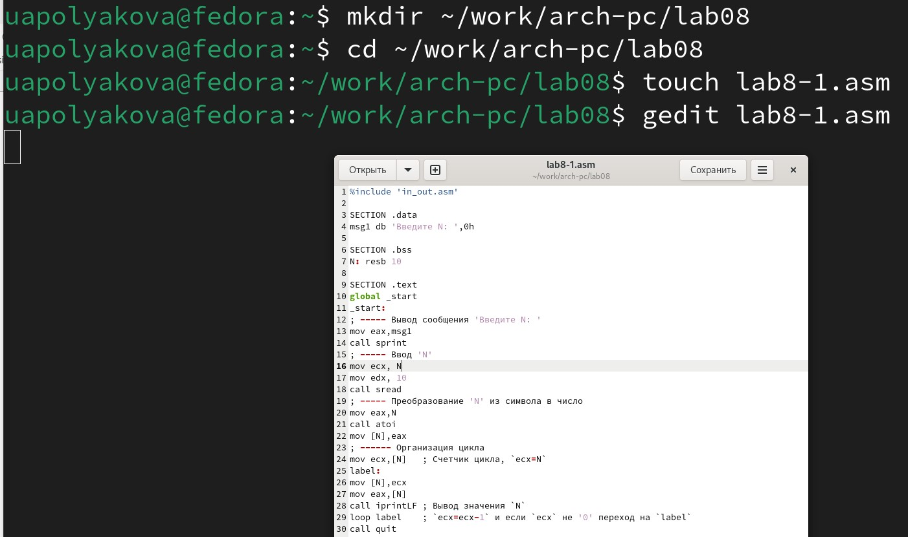{#fig:001 width=70%}

2. Создаем исполняемый файл и запускаем его (Рис. 2).

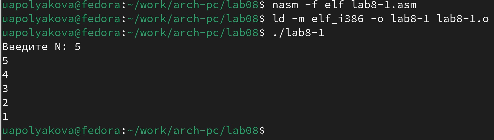{#fig:002 width=70%}

3. Изменяем текст программы для примера некорректной работы (Рис. 3).

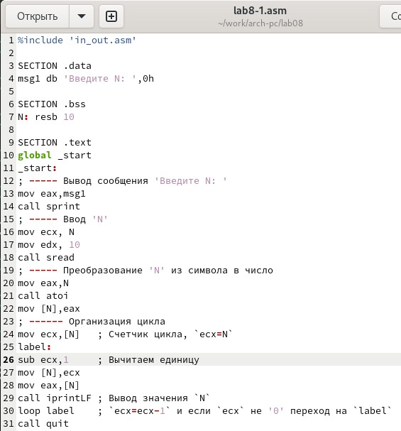{#fig:003 width=70%}

4. Создаем исполняемый файл и запускаем его (Рис. 4)

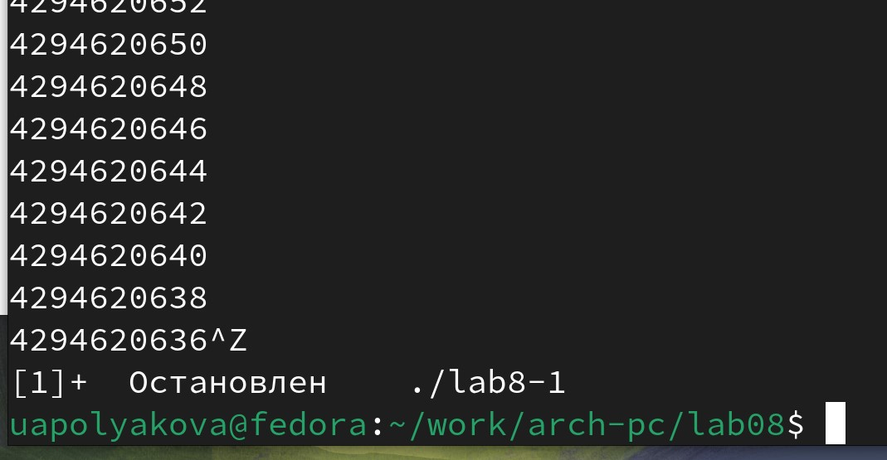{#fig:004 width=70%}

Регистр принимает значение каждый раз на 2 меньше, так как loop вычитает 1, и мы принудительно вычитаем 1. Цикл стал бесконечным, число проходов не соответствует введенному числу.

5. Изменяем текст программы, используя стек, чтобы сохранить корректность работы (Рис. 5).

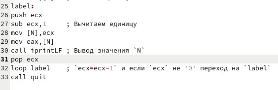{#fig:005 width=70%}

6. Создаем исполняемый файл и запускаем его (Рис. 6).

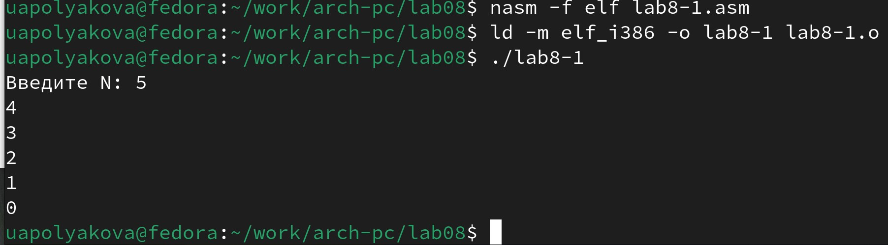{#fig:006 width=70%}

Число проходов цикла соответствует N.

7. Создаем lab8-2.asm по листингу 8.2. (Рис. 7).

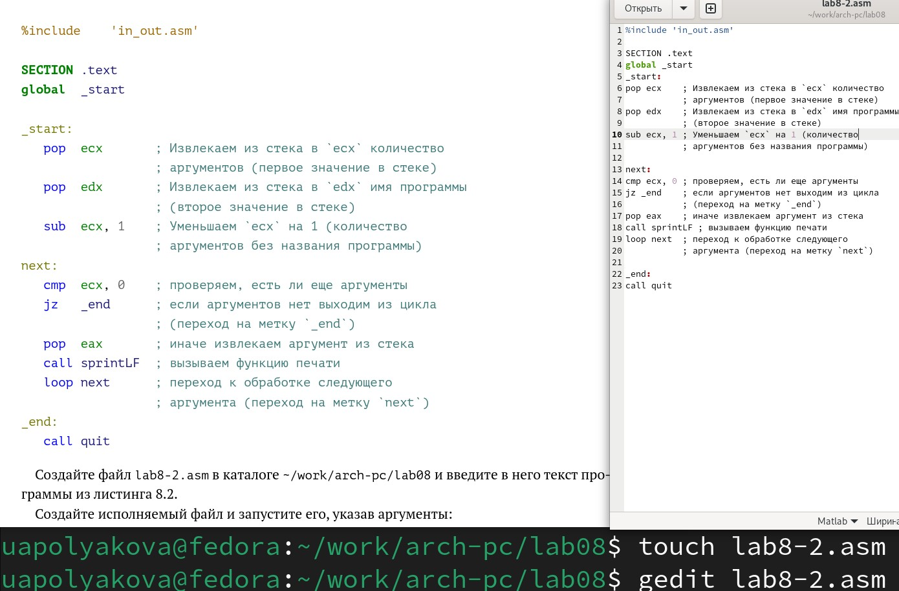{#fig:007 width=70%}

8. Создаем исполняемый файл и запускаем его с указанными аргументами (Рис. 8).

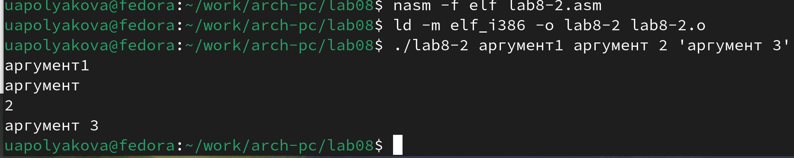{#fig:008 width=70%}

Программой было обработано 4 аргумента, то есть все те, которые были указаны через пробел.

9. Создаем lab8-3.asm по листингу 8.3. (Рис. 9).

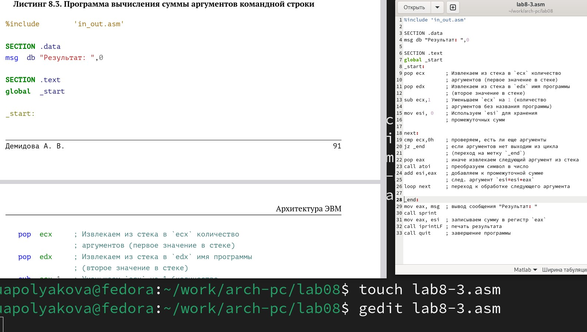{#fig:009 width=70%}

10. Создаем исполняемый файл и запускаем его, указав аргументы (Рис. 10).

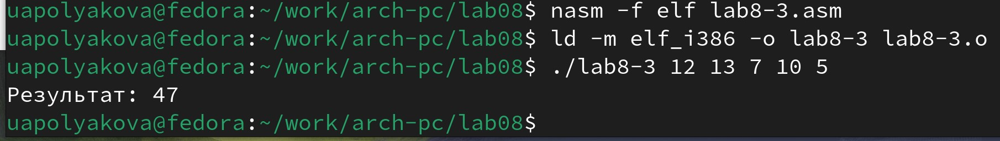{#fig:010 width=70%}

11. Изменяем текст lab8-3.asm так, чтобы программа считала произведение аргументов (Рис. 11).

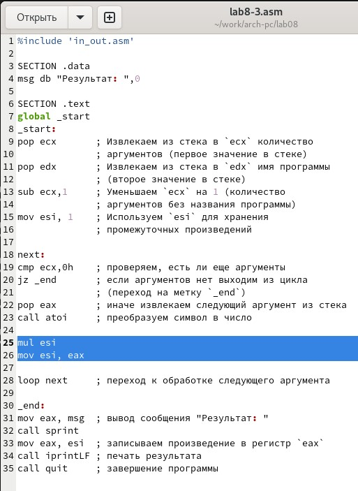{#fig:011 width=70%}

12. Создаем исполняемый файл и запускаем его, указав аргументы, проверяем работу (Рис. 12).

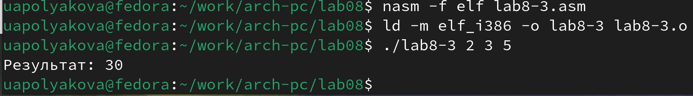{#fig:012 width=70%}

# Результаты выполнения заданий для самостоятельной работы

1. Пишем программу, которая находит сумму значений функции f(x), где в х подставляются значения из аргументов командной строки. В предыдущих лабораторных был Вариант 3, поэтому сейчас также был выбран Вариант 3 f(x) = 10x - 5 (Рис. 13).

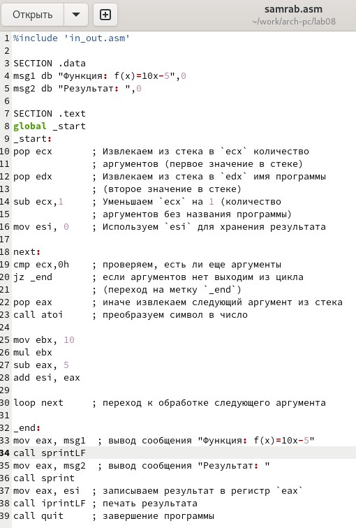{#fig:013 width=70%}

2. Создаем исполняемый файл и запускаем его, указав несколько наборов иксов (Рис. 14).

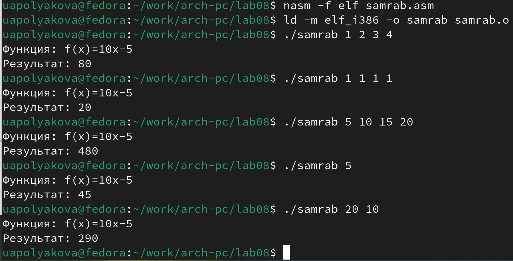{#fig:014 width=70%}

# Вывод

Были приобретены навыки написания программ с использованием циклов и обработкой аргументов командной строки.
