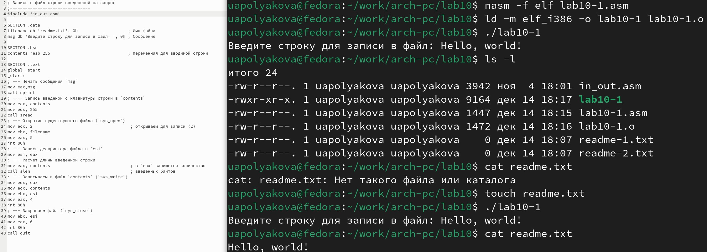

---
## Front matter
title: "ОТЧЕТ по лабораторной работе №10"
author: "Полякова Юлия Александровна"

## Generic otions
lang: ru-RU
toc-title: "Содержание"

## Bibliography
bibliography: bib/cite.bib
csl: pandoc/csl/gost-r-7-0-5-2008-numeric.csl

## Pdf output format
toc: true # Table of contents
toc-depth: 2
lof: true # List of figures
lot: true # List of tables
fontsize: 12pt
linestretch: 1.5
papersize: a4
documentclass: scrreprt
## I18n polyglossia
polyglossia-lang:
  name: russian
  options:
	- spelling=modern
	- babelshorthands=true
polyglossia-otherlangs:
  name: english
## I18n babel
babel-lang: russian
babel-otherlangs: english
## Fonts
mainfont: IBM Plex Serif
romanfont: IBM Plex Serif
sansfont: IBM Plex Sans
monofont: IBM Plex Mono
mathfont: STIX Two Math
mainfontoptions: Ligatures=Common,Ligatures=TeX,Scale=0.94
romanfontoptions: Ligatures=Common,Ligatures=TeX,Scale=0.94
sansfontoptions: Ligatures=Common,Ligatures=TeX,Scale=MatchLowercase,Scale=0.94
monofontoptions: Scale=MatchLowercase,Scale=0.94,FakeStretch=0.9
mathfontoptions:
## Biblatex
biblatex: true
biblio-style: "gost-numeric"
biblatexoptions:
  - parentracker=true
  - backend=biber
  - hyperref=auto
  - language=auto
  - autolang=other*
  - citestyle=gost-numeric
## Pandoc-crossref LaTeX customization
figureTitle: "Рис."
tableTitle: "Таблица"
listingTitle: "Листинг"
lofTitle: "Список иллюстраций"
lotTitle: "Список таблиц"
lolTitle: "Листинги"
## Misc options
indent: true
header-includes:
  - \usepackage{indentfirst}
  - \usepackage{float} # keep figures where there are in the text
  - \floatplacement{figure}{H} # keep figures where there are in the text
---

# Цель работы

Приобретение навыков написания программ для работы с файлами.

# Результаты выполнения лабораторной работы

1. Создаем каталог для программам лабораторной работы № 10, переходим в него и создаем файлы lab10-1.asm, readme-1.txt и readme-2.txt (Рис. 1).

{#fig:001 width=70%}

2. Вводим в файл lab10-1.asm текст программы из листинга 10.1 (Программа записи в файл сообщения). Создаем исполняемый файл и запускаем его (Рис. 2).

{#fig:002 width=70%}

3. С помощью chmod меняем права доступа к файлу. Запрещаем всем группам его выполнение, поэтому при попытке исполнения выводится сообщение об отказе в доступе (Рис. 3).

{#fig:003 width=70%}

4. С помощью команды chmod изменяем права доступа к файлу lab10-1.asm с исходным текстом программы, добавив права на исполнение. При попытке запуска выводится сообщение о синтаксической ошибке. Чтобы файл заработал его сначала нужно провести через определенные операции командами nasm и ld, чтобы машина могла работать с программой (Рис. 4)

{#fig:004 width=70%}

5. В соответствии с вариантом в таблице 10.4 (Вариант 3) предоставляем права доступа к файлу readme-1.txt представленные в символьном виде, а для файла readme-2.txt – в двоичном виде. Проверяем правильность выполнения с помощью команды ls -l (Рис. 5).

{#fig:005 width=70%}

# Результаты выполнения заданий для самостоятельной работы

1. Пишем программу которая добавляет в созданный в ходе нее файл сообщение "Меня зовут" и введенную после сообщения "Как Вас зовут?" строку (Рис. 6).

{#fig:006 width=70%}

2. Создаем исполняемый файл, проверяем его работу, смотрим его наличие и содержимое с помощью ls и cat (Рис. 7).

{#fig:007 width=70%}

# Вывод

Были приобретены навыки написания программ для работы с файлами.
